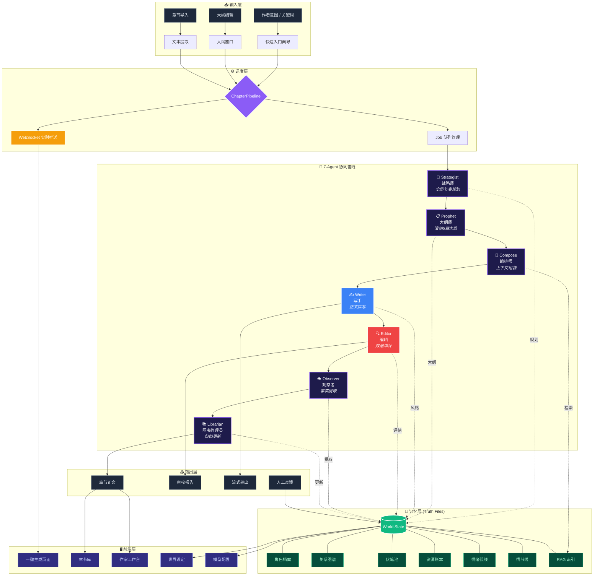

<p align="center">
  
  
</p>

<h1 align="center">🖊 inkflow</h1>

<p align="center">
  <strong>多智能体协同的小说创作引擎：让长篇创作重获连贯与灵魂</strong><br>
  A Narrative Symphony Orchestrated by 7 Specialized AI Agents.
</p>

<p align="center">
  
  
  
  
  
</p>

---

## 🌟 为什么选择 inkflow?

**长篇小说创作最怕什么？** 逻辑断层、角色崩坏、伏笔遗忘、以及千篇一律的"AI 翻译味"。

**inkflow** 并不是一个简单的对话框，它是一个模拟 **顶级小说工作室** 的生产管线。它通过 7 个专业 Agent 的深度博弈与协作，确保你的故事从第 1 章到第 1000 章都拥有统一的灵魂。

### 核心黑科技
- 🧠 **动态长效记忆**：不再依赖 LLM 脆弱的上下文窗口，通过"真相文件 (Truth Files)"持久化存储世界观、角色弧线与万字伏笔池。
- 🎭 **7 智能体管线**：从战略布局到逐字润色，每个环节都有专家 Agent 把关。
- 🛡️ **去 AI 味引擎**：内置深度审校模型，自动识别并重写 40+ 类 AI 常用废话，注入风格指纹。
- 🧪 **文风蒸馏系统**：只需上传样章，即可"克隆"特定作者的叙事节奏与遣词造句习惯。

---

## ✨ 核心特性一览

### 1. 7-Agent 协同管线 (The Pipeline)
基于 **WebSocket** 的实时进度流，你可以亲眼看到故事是如何诞生的：
- 🎯 **Strategist (战略师)**: 掌控全局节奏，决定章节的情绪走向。
- 📋 **Prophet (大纲师)**: 滚动规划未来 5 章的大纲，确保逻辑不跑偏。
- 🔧 **Compose (编排师)**: 从万字内存中提取最相关的"真相片段"喂给写手。
- ✍️ **Writer (写手)**: 拒绝水文！根据风格指纹输出极具感染力的正文。
- 🔍 **Editor (编辑)**: 双层审计（代码层 + LLM 层），不合格？重写！
- 👁 **Observer (观察者)**: 实时提取新出现的角色、物品与伏笔。
- 📚 **Librarian (图书管理员)**: 自动更新世界设定，维护记忆的绝对权威。

### 2. 双层审计系统 (Dual-Layer Audit)
**代码层（零 Token 消耗）**：
- 角色状态一致性：死亡角色不应再出场
- 资源连续性：消耗物品不应凭空出现
- 伏笔生命周期：过期伏笔自动告警
- 信息边界：角色不应知道他不该知道的事
- 破折号控制：每章最多 4 个，自动清理多余

**LLM 层（创意质量评估）**：
- 风格一致性、情节逻辑、情感表达、节奏感、对话自然度、描写质量、伏笔巧妙度

### 3. 真相文件系统 (World State)
系统的"故事大脑"，包含：
- **角色档案**: 自动追踪性格转变与状态（受伤、黑化等）。
- **关系图谱**: 动态维护角色间的恩怨情仇。
- **伏笔池**: 埋下的每一个坑，系统都会在合适的时机提醒你填上。
- **资源账本**: 武器、功法、金钱？系统帮你算得清清楚楚。
- **情绪弧线**: 追踪每个角色的情感变化。
- **信息边界**: 记录每个角色知道什么、不知道什么。

### 4. 全新的 Glassmorphism Web UI
深度优化的沉浸式创作界面：
- **实时看板**: 监控所有 Agent 的思考状态与生成进度。
- **沉浸式工作台**: 三栏布局，左手查阅记忆，右手实时审校，中间专注创作。
- **角色关系图谱**: 可视化角色之间的关系网络。
- **伏笔追踪面板**: 实时监控伏笔状态（待收/已收/过期）。
- **章节对比**: 初稿 vs 终稿对比，一键重写已保存章节。

### 5. 全自动模式
- 🤖 **一键生成多章**: 输入章节数，无人值守自动创作。
- ⚡ **智能重写**: 质量不达标自动重写（最多 2 次）。
- 📊 **实时进度**: WebSocket 推送每章生成状态。

### 6. 文风蒸馏系统
- 📖 **风格分析**: 上传样章，6 维度深度分析写作风格。
- 🧬 **风格克隆**: 自动生成 5 种定制 Agent Skill（写手、战略师、大纲师、编辑、图书管理员）。
- 🔄 **风格融合**: 多本书风格融合，创造独特写作风格。

---

## 🚀 快速启动

### 安装环境

推荐使用 [uv](https://github.com/astral-sh/uv) 极速同步环境：

```bash
git clone https://github.com/real-Elysia886/inkflow.git
cd inkflow
uv sync
```

### 启动创作引擎

```bash
python main.py
```
访问 `http://127.0.0.1:8000` 即可开启你的创作之旅。

> **首次使用**：进入 **模型配置** 页面，添加 LLM Provider（如 OpenAI、DeepSeek）并填入 API Key。

### Docker 部署

```bash
git clone https://github.com/real-Elysia886/inkflow.git
cd inkflow
docker-compose up -d --build
```

访问 `http://你的服务器IP:8000`，在 **模型配置** 页面添加 Provider 并填入 API Key 即可。

```bash
# 查看日志
docker-compose logs -f

# 停止服务
docker-compose down
```

---

## 🛠 架构逻辑



---

## ⚙️ 模型配置建议

inkflow 支持为不同角色路由配置不同的 LLM 模型，以平衡质量、速度和成本。以下是推荐配置：

### 角色路由与模型推荐

| 角色 | 用途 | 推荐模型等级 | 温度 | Max Tokens | 说明 |
|------|------|-------------|------|------------|------|
| **Strategist** (战略师) | 全局节奏规划 | 高质量 | 0.3 | 4096 | 需要强推理能力，决定故事走向 |
| **Prophet** (大纲师) | 章节大纲生成 | 高质量 | 0.4 | 4096 | 需要逻辑一致性，规划未来5章 |
| **Writer** (写手) | 正文撰写 | 平衡 | 0.8 | 8192 | 需要创意和流畅度，温度可适当提高 |
| **Editor** (编辑) | 质量审校 | 高质量 | 0.2 | 4096 | 需要精准判断，温度要低 |
| **Observer** (观察者) | 事实提取 | 快速 | 0.3 | 2048 | 结构化提取，不需要创意 |
| **Reflector** (反思者) | 事实写入 | 快速 | 0.2 | 2048 | 结构化操作，不需要创意 |
| **Librarian** (图书管理员) | 章节摘要 | 快速 | 0.3 | 2048 | 摘要生成，不需要创意 |

### 模型选择策略

#### 高质量模型（推荐用于关键角色）
适用于 Strategist、Prophet、Editor 等需要强推理和精准判断的角色。

#### 平衡模型（推荐用于创意角色）
适用于 Writer 等需要创意和流畅度的角色。

#### 快速模型（推荐用于结构化任务）
适用于 Observer、Reflector、Librarian 等执行结构化操作的角色。

### 参数设置建议

| 参数 | 规划/大纲 | 正文撰写 | 质量审校 | 事实提取 |
|------|----------|----------|----------|----------|
| **温度** | 0.2-0.4 | 0.7-0.9 | 0.1-0.3 | 0.2-0.4 |
| **Max Tokens** | 2048-4096 | 4096-8192 | 2048-4096 | 1024-2048 |

---

## 🤝 愿景

我们相信，AI 不应替代作者的想象力，而应作为**全能的助手**，去处理繁琐的设定对齐与质量自检，让作者专注于那一瞬间的灵感迸发。

欢迎提交 PR 或 Issue。让我们一起构建全球最懂小说家的创作框架！

**License**: MIT
